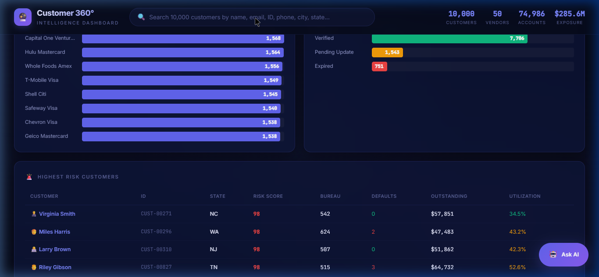

# 🔮 Customer 360° Intelligence Dashboard

A full-featured **Customer Intelligence Dashboard** that procedurally generates **10,000 US-based customer profiles** on the fly and provides a unified 360° view across **50 vendors** and **10 categories** — featuring a built-in **Retrieval-Augmented Generation (RAG)** Q&A engine powered by a **Local Large Language Model (LLM)** for deep semantic analysis.



---

## ✨ Features

### 📊 Overview Dashboard
- **KPI Cards** — Total customers (10K), risk distribution (low/moderate/high), average utilization, total defaults
- **Risk Distribution Chart** — Color-coded horizontal bar chart (green/amber/red)
- **Top States by Customers** — Geographic distribution across 20 US states
- **Top Vendors by Accounts** — Most popular card/vendor relationships
- **KYC Status Breakdown** — Verified, pending, and expired counts
- **Highest Risk Table** — Top 15 highest-risk customers with clickable profiles

### 🔍 Smart Search (10K Scale)
- Debounced search across name, email, customer ID, phone, city, and state
- Live dropdown with result count and risk tier badges
- Shows top 20 matches from 10,000 records instantly

### 👤 Full Customer Profile (per customer)
| Section | Details |
|---------|---------|
| **Identity & KYC** | Name, SSN (masked), DOB, age, email, phone, address, KYC status, last verified date |
| **Financial Summary** | Total outstanding, credit limit, utilization rate (with animated bar), next payment due |
| **Risk Profile** | 0–100 animated gauge, risk tier, credit bureau score, defaults, late payments, consecutive on-time |
| **All Accounts** | Every card across vendors — balance vs limit bar, account status (active/closed/defaulted), open date |
| **Payment History** | 12-month grid per account — green (on-time), amber (late), red (missed) |
| **Activity Timeline** | Chronological audit trail — payments, disputes, defaults, KYC events, settlements |
| **Vendor Relationships** | All vendor cards grouped by category with status indicators |
| **Lifetime Value** | Total spend, average monthly spend, disputes filed, customer tenure, active vs total accounts |

### 🤖 Q&A Engine (Local RAG + LLM)
Ask complex questions in plain English and get instant answers with formatted tables and clickable profile links.

The natural language processing is handled natively on your machine using a fully custom **Retrieval-Augmented Generation (RAG)** pipeline:
1. **Embedding generation:** Your query is vectorized via `all-MiniLM-L6-v2`.
2. **Dense Search:** An ultra-fast `Numpy` dot-product search scans 10,000 serialized risk profiles in milliseconds to retrieve top matches.
3. **LLM Synthesis:** The context is streamed to a local inference engine (like Ollama running `qwen2.5-coder:7b`) to synthesize an analytical response without ever uploading private financial data to the cloud.

**Supported query types:**

| Category | Example Queries |
|----------|----------------|
| **Counts** | "How many high risk customers?", "Count defaults" |
| **Totals** | "Total outstanding", "Total spend", "Total credit limit" |
| **Averages** | "Average credit score", "Avg utilization", "Average age" |
| **Rankings** | "Top 10 by spend", "Bottom 5 by bureau score", "Highest utilization" |
| **Filters** | "Show defaulted accounts", "Customers with expired KYC" |
| **Geography** | "Customers in California", "How many in TX?" |
| **Analysis** | "Risk breakdown", "Risk breakdown by state", "KYC status" |
| **Lookups** | "CUST-00042", customer name, vendor name |
| **Portfolio** | "Portfolio summary", "Overview" |

---

## 🛠️ Tech Stack

| Layer | Technology |
|-------|-----------|
| **Frontend Structure** | HTML5 (semantic, SEO-optimized) |
| **Frontend Styling** | Vanilla CSS — dark glassmorphism, CSS custom properties, responsive grid |
| **Frontend Logic** | Vanilla JavaScript — procedural generation, animations, fetch API |
| **Backend API** | Python `FastAPI` (REST API mapped to `/api/chat`) |
| **RAG Vector Store** | `Numpy` dense arrays (` embeddings.npy`) — fast, RAM-based dot product search |
| **Embedding Model** | `sentence-transformers/all-MiniLM-L6-v2` |
| **LLM Inference** | `Ollama` local LLM (e.g., `qwen2.5-coder:7b`) |

**100% Local Execution. Deep Semantic Search. Zero Cloud Dependencies.**

---

## 📁 Project Structure

```
Userdashboard/
├── index.html          # Main dashboard page
├── styles.css          # Complete design system (dark theme, glassmorphism, animations)
├── data.js             # Seeded PRNG generator — 10K customers
├── app.js              # Dashboard logic, search, profile rendering, RAG fetch
├── backend/            # RAG Python Backend
│   ├── requirements.txt
│   ├── ingest.py       # Embeds 10,000 JSON profiles into Numpy NPY arrays using sentence-transformers
│   ├── server.py       # FastAPI server providing the /api/chat RAG endpoint connecting to Ollama
│   ├── customers.json  # Exported 10K raw profiles
│   ├── documents.json  # Raw text chunks for RAG context bridging
│   └── embeddings.npy  # Generated 384-dimensional dense vectors
└── README.md           # This file
```

---

## 🚀 Getting Started

### Prerequisites
- Python 3.9+
- A running local instance of [Ollama](https://ollama.ai/) with a model pulled (default: `qwen2.5-coder:7b`)

### 1. Setup Backend & RAG Vector Store

```bash
cd Userdashboard/backend
python -m pip install -r requirements.txt

# Run the ingestion script (takes ~15-20m on CPU for 10,000 customers)
# This creates the embeddings.npy file
python ingest.py 

# Start the FastAPI Server (Port 8001)
python server.py
```

### 2. Start Frontend

Open a new terminal:
```bash
cd Userdashboard
python -m http.server 8888
# Open http://localhost:8888
```

> **Architecture Note:** The dashboard procedurally generates 10,000 profiles via a seeded PRNG on page load. The backend exposes true Semantic Search over these records leveraging locally computed dense vectors and Ollama inference.

---

## 📐 Data Architecture

### 10 Vendor Categories (50 vendors total)

| Category | Vendors |
|----------|---------|
| 💳 Premium Cards | Amex Platinum, Amex Gold, Citi Prestige, Chase Sapphire Reserve, Capital One Venture X |
| ✈️ Travel | Expedia Chase, Booking.com Visa, Priceline Barclays, Hotels.com Wells Fargo, Kayak Capital One |
| 🛒 Retail | Amazon Prime Visa, Target RedCard, Costco Citi, Walmart Capital One, Best Buy Citi |
| ⛽ Fuel | Shell Citi, BP Visa, ExxonMobil Amex, Chevron Visa, Marathon BofA |
| 🛫 Airlines | Delta SkyMiles Amex, United Explorer Chase, AA Citi AAdvantage, Southwest Chase, JetBlue Barclays |
| 🏨 Hotels | Marriott Bonvoy Amex, Hilton Honors Amex, Hyatt Chase, IHG Premier Chase, Wyndham Capital One |
| 📱 Telecom | T-Mobile Visa, Verizon Visa, AT&T Access, Xfinity Visa, Spectrum Mastercard |
| 🥬 Grocery | Whole Foods Amex, Kroger Visa, Safeway Visa, Trader Joe's Visa, Publix Visa |
| 🛡️ Insurance | State Farm Visa, Geico Mastercard, Progressive Visa, Allstate Visa, Liberty Mutual Visa |
| 🎬 Entertainment | Netflix Visa, Disney Visa, Hulu Mastercard, Spotify Visa, AMC Mastercard |

### Customer Profile Distribution
- **Risk tiers:** ~55% Low, ~30% Moderate, ~15% High
- **KYC status:** ~78% Verified, ~15% Pending, ~7% Expired
- **Accounts per customer:** 3–15 depending on risk tier
- **Geography:** 20 US states, 200 cities

### Data Model (per customer)
```
Customer
├── Identity (name, SSN, DOB, email, phone, address, city, state, zip)
├── KYC (status, last_updated)
├── Financial (outstanding, credit_limit, utilization, next_payment, total_spend, avg_monthly)
├── Risk (score 0-100, tier, defaults, late_payments, consecutive_on_time, bureau_score)
├── Accounts[] (vendor, account_number, card_type, balance, limit, status, opened_date)
│   └── PaymentHistory[] (12 months × {month, status: on-time|late|missed})
└── Timeline[] (date, type, description, amount?)
```

---

## 🎨 Design Philosophy

- **Dark glassmorphism** with `backdrop-filter` blur and frosted-glass cards
- **Vibrant color-coded risk tiers**: 🟢 Green (low), 🟡 Amber (moderate), 🔴 Red (high)
- **Animated SVG risk gauge** with dynamic stroke-dashoffset
- **Micro-animations**: hover lift effects, timeline slide-ins, payment dot scaling
- **Responsive grid layout** adapting from 3-column to 1-column on mobile
- **Monospaced typography** (JetBrains Mono) for all financial/numeric data

---

## 🏗️ Production Architecture Recommendation

For an enterprise deployment with streaming data, the recommended RAG architecture:

```
┌─────────────────────────────────────────────┐
│                   Frontend                   │
│         (This Dashboard UI Layer)            │
└──────────────────┬──────────────────────────┘
                   │
         ┌─────────▼──────────┐
         │  Unified REST API   │
         │  (Federation Layer) │
         └─────────┬─────────┬┘
                   │         │
    ┌──────────────┼───┐  ┌──┴─────────────┐
    │              │   │  │ NLP & AI Layer │
┌───▼───┐    ┌────▼─┐  │  ├────────────────┤
│Cat 1-3│    │Cat 4+│  │  │ Enterprise LLM │
│Stores │    │Stores│  │  │ Vector DB Store│
└───────┘    └──────┘  │  └────────────────┘
                       │
             ┌─────────▼──────────┐
             │  Data Lake (HDFS)  │
             └────────────────────┘
```

- **Join key:** `user_id` or email across all vendor datastores
- **Data lake:** Databricks / Snowflake for scheduled ingestion and embedding generation
- **API layer:** Federated queries across category datastores in real-time
- **Vector DB:** ChromaDB or Milvus for large-scale semantic sub-second retrieval
- **LLM Synthesis:** Private on-prem deployment of Llama 3 or hosted Azure OpenAI

---

## 📄 License

MIT License — free for personal and commercial use.
